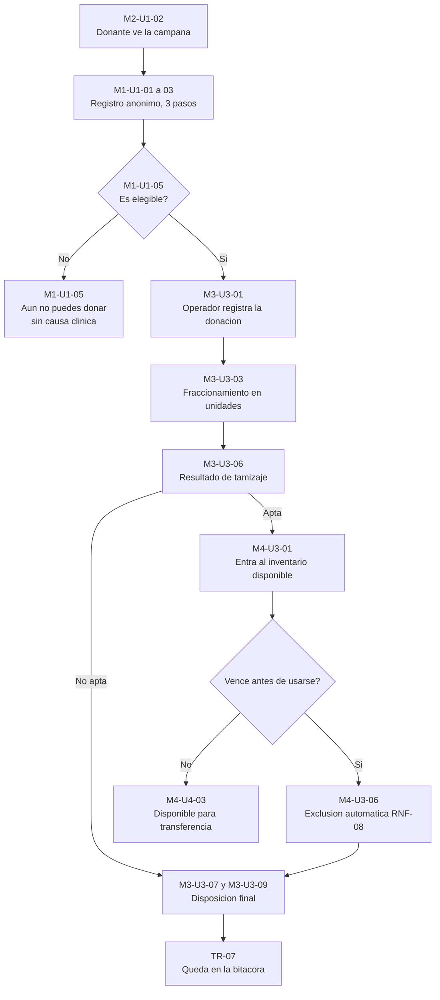
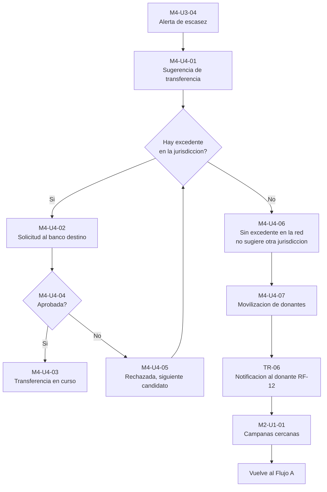

# RedVital Web — Inventario de pantallas

| Campo | Valor |
|---|---|
| **Versión** | 1.0 |
| **Fecha** | 2026-08-27 |
| **Estado** | Propuesta — pendiente de aprobación del Product Owner |
| **Alcance** | Los 6 módulos vigentes y los 7 tipos de usuario del SRS v2.0 |
| **Historia asociada** | HT-16 · Prototipos de interfaz (Sprint 1, entrega Semana 6) |
| **Fuentes** | `redvital-docs/docs/requerimientos/srs.md` v2.0 · `docs/contexto/00-contexto-maestro.md` · `docs/contexto/ui-prototipos.md` |

Este documento **no contiene mockups**. Define qué pantallas existen, quién las usa, qué requerimiento cubre cada una y cómo se refleja en ella cada restricción no negociable. El prototipo de alta fidelidad se construye a partir de aquí, no antes.

---

## 1. Cómo leer este inventario

**Identificador:** `<Módulo>-<Usuario>-<consecutivo>`. `M3-U3-06` es la sexta pantalla del módulo M3 para el usuario U3. Las transversales usan el prefijo `TR-`.

El **módulo** lo da el capítulo y va codificado en el ID; el **usuario principal** lo da la sección y también va en el ID. La columna *Usuario(s)* se mantiene de todos modos porque hay pantallas compartidas entre perfiles, y en esos casos el ID solo nombra al dueño principal.

**Tipo:**

- **Feliz** — el camino esperado cuando todo ocurre como debe.
- **Excepción** — estado de error, vacío, bloqueo o denegación. No son variantes menores: son pantallas con diseño propio. Una excepción mal resuelta es donde se rompen RNF-01 y RNF-02.

**Restricción y cómo se refleja:** vacío (`—`) significa que ninguna de las tres restricciones críticas condiciona esa pantalla en particular. Cuando hay contenido, describe la decisión de diseño concreta de *esa* pantalla, no la regla general.

**Convención de acceso**, tomada de la matriz del SRS: `E` = escribe o modifica · `L` = solo consulta · vacío = sin acceso.

---

## 2. Matriz de cobertura

Celdas de la matriz del SRS (§3), con el número de pantallas que este inventario define para cada una.

| Usuario | M1 Donantes | M2 Campañas | M3 Ciclo de Vida | M4 Inventario | M5 Territorial | M6 Analítica | Transversal |
|---|---|---|---|---|---|---|---|
| U1 — Donante anónimo | **E** · 6 | **L** · 3 | — | — | — | — | 2 |
| U2 — Donante registrado | **E** · 10 | **L** · 1 | — | — | — | — | 4 |
| U3 — Operador de banco | **L** · 2 | **L** · 1 | **E** · 11 | **E** · 7 | — | — | 3 |
| U4 — Administrador de banco | **L** · 1 | **E** · 5 | **L** · 1 | **E** · 8 | **L** · 1 | **L** · 1 | 3 |
| U5 — Coordinador territorial | — | **L** · 1 | **L** · 2 | **L** · 2 | **E** · 4 | **L** · 2 | 4 |
| U6 — Administrador nacional | — | **L** · 1 | **L** · 1 | **L** · 1 | **E** · 5 | **E** · 7 | 3 |
| U7 — Auditor | — | — | **L** · 1 | **L** · 1 | **L** · 1 | — | 4 |
| **Total del módulo** | **19** | **12** | **16** | **19** | **11** | **10** | **9** |

**Verificación de la matriz:** ninguna celda con `E` o `L` quedó sin pantalla, y ninguna celda vacía tiene pantallas asignadas. Las columnas de M1 para U5, U6 y U7, y las de M5 y M6 para U1, U2 y U3, están deliberadamente vacías: la separación entre el mundo del donante y el mundo de la supervisión es una decisión de diseño del SRS, no un olvido.

**Total: 96 pantallas.** El desglose por tipo aparece en §11.

---

## 3. Transversal

No pertenecen a ningún módulo. Dos de ellas —el centro de notificaciones y la bitácora— no tienen módulo dueño en el SRS; ver §12.

| ID | Pantalla | Usuario(s) | RF / RNF | Tipo | Restricción y cómo se refleja |
|---|---|---|---|---|---|
| TR-01 | Inicio de sesión | U2–U7 | *ninguno* | Feliz | — |
| TR-02 | Credenciales incorrectas | U2–U7 | *ninguno* | Excepción | El mensaje no revela si el usuario existe. Dice qué hacer, no solo qué falló |
| TR-03 | Estructura de navegación por rol | U1–U7 | RNF-02 | Feliz | **RNF-02.** Siete variantes del menú. Cada rol solo ve las entradas de los módulos donde tiene `E` o `L`. Lo que no corresponde no aparece deshabilitado ni con candado: no aparece |
| TR-04 | Denegación de acceso por jurisdicción | U3, U4, U5 | RNF-02 | Excepción | **RNF-02.** Dice explícitamente que el dato pertenece a otra jurisdicción y cuál es la jurisdicción propia del usuario. **No nombra la jurisdicción ajena.** No es un error 403 genérico: informa que el intento quedó registrado en la bitácora |
| TR-05 | Sesión expirada | U2–U7 | *ninguno* | Excepción | Al reanudar, el usuario vuelve a la pantalla donde estaba, sin perder el trabajo en curso |
| TR-06 | Centro de notificaciones del donante | U2 | RF-12 | Feliz | Tres tipos: elegibilidad recuperada, campaña cercana, reconocimiento obtenido. Ninguna notificación menciona resultados de tamizaje |
| TR-07 | Bitácora de auditoría | U7 | RF-06, RNF-02 | Feliz | **RNF-01 y RNF-02.** Registra el qué, el quién y el cuándo de cada cambio de estado y de cada intento denegado. **La bitácora registra que una unidad pasó a no apta; no registra por qué.** Ni el auditor ve la causa clínica |
| TR-08 | Detalle de un evento de la bitácora | U7 | RF-06 | Feliz | **RNF-01.** Mismo criterio: actor, marca temporal, estado anterior y posterior. Sin campo de motivo clínico |
| TR-09 | Recurso no encontrado | U1–U7 | *ninguno* | Excepción | Se distingue de TR-04 a propósito: "no existe" y "existe pero no te corresponde" son respuestas distintas, y confundirlas filtra información |

---

## 4. M1 — Gestión de Donantes

Backend: `redvital-donacion-service`. Frontend: `src/modules/donantes/`.

### U1 — Donante anónimo (`E`)

| ID | Pantalla | Usuario(s) | RF / RNF | Tipo | Restricción y cómo se refleja |
|---|---|---|---|---|---|
| M1-U1-01 | Registro anónimo · Paso 1 de 3: tipo de sangre | U1 | RF-01, RNF-03 | Feliz | **RNF-03.** Solo tipo de sangre y una opción "no lo sé". Ningún campo de identificación. El indicador de progreso dice "Paso 1 de 3" de forma visible |
| M1-U1-02 | Registro anónimo · Paso 2 de 3: municipio y disponibilidad | U1 | RF-01, RNF-03 | Feliz | **RNF-03.** Municipio y franja horaria. Sin dirección, sin teléfono obligatorio |
| M1-U1-03 | Registro anónimo · Paso 3 de 3: confirmación de datos | U1 | RF-01, RNF-03 | Feliz | **RNF-03.** Último paso. Un único correo **opcional** para avisos, marcado como opcional en la etiqueta, no solo por ausencia de asterisco |
| M1-U1-04 | Código de donación entregado | U1 | RF-01 | Feliz | **RNF-03.** Esta pantalla es el **resultado**, no un cuarto paso: el registro ya se completó en tres. Entrega un código de referencia que sustituye al perfil, advirtiendo que sin él no hay forma de recuperar la donación |
| M1-U1-05 | Aún no puedes donar | U1 | RF-02 | Excepción | **RNF-01.** Dice la fecha desde la cual podrá donar y por qué (intervalo entre donaciones), en lenguaje llano. **No menciona ninguna condición de salud** |
| M1-U1-06 | Consulta de una donación con el código | U1 | *ninguno* | Feliz | **RNF-01.** Muestra que la donación fue recibida y su fecha. **No muestra el estado de tamizaje de las unidades derivadas.** Pantalla sin RF que la sustente — ver §12.2 |

### U2 — Donante registrado (`E`)

| ID | Pantalla | Usuario(s) | RF / RNF | Tipo | Restricción y cómo se refleja |
|---|---|---|---|---|---|
| M1-U2-01 | Registro con perfil completo | U2 | RF-01 | Feliz | Camino largo y voluntario. Explica qué gana el donante frente al registro anónimo, sin presionar |
| M1-U2-02 | Consentimiento de tratamiento de datos | U2 | RF-01, RD-08 | Feliz | Ley 1581. Consentimiento explícito y separado, no una casilla premarcada dentro del formulario |
| M1-U2-03 | Mi perfil: tipo de sangre y elegibilidad | U2 | RF-02 | Feliz | Estado de elegibilidad y próxima fecha en que puede donar |
| M1-U2-04 | Aún no eres elegible | U2 | RF-02 | Excepción | **RNF-01.** Muestra la fecha en que recupera la elegibilidad. Si la causa fuera clínica, la pantalla **no la nombra**: indica consultar con el banco, nunca el motivo |
| M1-U2-05 | Mi historial de donaciones | U2 | RF-17 | Feliz | **RNF-01.** Lista fecha, banco y campaña de cada donación. **No muestra el resultado de tamizaje ni el destino de las unidades derivadas.** Supuesto de diseño que requiere decisión — ver §12.3 (h) |
| M1-U2-06 | Historial vacío | U2 | RF-17 | Excepción | Estado de primer ingreso. Invita a ver campañas cercanas, sin lenguaje de urgencia |
| M1-U2-07 | Mis reconocimientos | U2 | RF-11 | Feliz | **Decreto 1571.** Insignias y niveles por recurrencia, con agradecimiento explícito. Sin puntos, sin saldo, sin canje, sin descuentos, sin ranking contra otros donantes |
| M1-U2-08 | Sin reconocimientos todavía | U2 | RF-11 | Excepción | Explica cómo se obtienen, en tono de agradecimiento y no de desafío |
| M1-U2-09 | Reserva de cupo en una campaña | U2 | RF-15 | Feliz | Muestra el tiempo que la reserva permanece vigente antes de liberarse |
| M1-U2-10 | Reserva expirada | U2 | RF-15 | Excepción | Explica que el cupo se liberó por inactividad y ofrece volver a reservar |

### U3 — Operador de banco (`L`)

| ID | Pantalla | Usuario(s) | RF / RNF | Tipo | Restricción y cómo se refleja |
|---|---|---|---|---|---|
| M1-U3-01 | Búsqueda y consulta de donante | U3 | RF-02 | Feliz | Solo lectura. Muestra elegibilidad y tipo de sangre, no historia clínica |
| M1-U3-02 | Donante no elegible | U3 | RF-02 | Excepción | **RNF-01.** Bloquea el registro de la donación e indica la fecha de elegibilidad. **No expone la causa** ni siquiera al personal operativo |

### U4 — Administrador de banco (`L`)

| ID | Pantalla | Usuario(s) | RF / RNF | Tipo | Restricción y cómo se refleja |
|---|---|---|---|---|---|
| M1-U4-01 | Donantes atendidos por mi banco | U4 | RF-02, RF-17 | Feliz | **RNF-02.** Alcance limitado a su institución. Sin buscador global de donantes |

---

## 5. M2 — Gestión de Campañas

Backend: `redvital-institucional-service`. Frontend: `src/modules/campanas/`.

### U1 y U2 — Donantes (`L`)

| ID | Pantalla | Usuario(s) | RF / RNF | Tipo | Restricción y cómo se refleja |
|---|---|---|---|---|---|
| M2-U1-01 | Campañas cercanas | U1, U2 | RF-08 | Feliz | Ordenadas por cercanía. No exige cuenta para consultarlas |
| M2-U1-02 | Detalle de una campaña | U1, U2 | RF-08 | Feliz | Lugar, fecha, horario y cupos restantes |
| M2-U1-03 | No hay campañas cerca | U1, U2 | RF-08 | Excepción | Ofrece ampliar el radio o avisar cuando haya una. No deja la pantalla vacía |
| M2-U2-01 | Campaña con cupos agotados | U2 | RF-08, RF-15 | Excepción | Ofrece la siguiente fecha disponible del mismo banco |

### U3 — Operador de banco (`L`)

| ID | Pantalla | Usuario(s) | RF / RNF | Tipo | Restricción y cómo se refleja |
|---|---|---|---|---|---|
| M2-U3-01 | Campañas activas de mi banco | U3 | RF-08 | Feliz | Consulta. Sirve para asociar la donación a su campaña en M3-U3-01 |

### U4 — Administrador de banco (`E`)

| ID | Pantalla | Usuario(s) | RF / RNF | Tipo | Restricción y cómo se refleja |
|---|---|---|---|---|---|
| M2-U4-01 | Campañas de mi banco | U4 | RF-08 | Feliz | **RNF-02.** Solo las de su institución |
| M2-U4-02 | Crear campaña | U4 | RF-08 | Feliz | Lugar, fechas, cupos y componentes objetivo |
| M2-U4-03 | Publicar campaña | U4 | RF-08 | Feliz | Confirmación explícita: publicar la hace visible a los donantes |
| M2-U4-04 | Seguimiento de resultados de campaña | U4 | RF-08 | Feliz | **RNF-01.** Reporta donaciones recibidas y unidades obtenidas. **No desglosa cuántas resultaron no aptas por causa alguna** |
| M2-U4-05 | Campaña sin inscritos | U4 | RF-08 | Excepción | Sugiere revisar fecha y difusión |

### U5 y U6 — Supervisión (`L`)

| ID | Pantalla | Usuario(s) | RF / RNF | Tipo | Restricción y cómo se refleja |
|---|---|---|---|---|---|
| M2-U5-01 | Campañas de mi jurisdicción | U5 | RF-08, RNF-02 | Feliz | **RNF-02.** El filtro territorial no ofrece departamentos ajenos, ni siquiera deshabilitados |
| M2-U6-01 | Campañas a nivel nacional | U6 | RF-08 | Feliz | Vista agregada, sin restricción territorial |

---

## 6. M3 — Ciclo de Vida de la Unidad

Backend: `redvital-donacion-service`. Frontend: `src/modules/ciclovida/`.

**Este es el módulo donde RNF-01 se juega por completo.** U3 es el único perfil que escribe: quien custodia la unidad es quien registra su ciclo de vida.

### U3 — Operador de banco (`E`)

| ID | Pantalla | Usuario(s) | RF / RNF | Tipo | Restricción y cómo se refleja |
|---|---|---|---|---|---|
| M3-U3-01 | Registro de una donación | U3 | RF-03 | Feliz | Asocia donante, banco y campaña. Admite donante anónimo por su código |
| M3-U3-02 | Donante no elegible: registro bloqueado | U3 | RF-02, RF-03 | Excepción | **RNF-01.** Impide continuar e indica la fecha de elegibilidad, sin causa |
| M3-U3-03 | Fraccionamiento de la donación en unidades | U3 | RF-03, RF-04 | Feliz | Una donación genera varias unidades trazables por separado. Cada una recibe su identificador desde aquí |
| M3-U3-04 | Unidades de mi banco | U3 | RF-04, RF-07 | Feliz | **RNF-01.** La columna de estado admite exactamente cuatro valores: apta, no apta, vencida, desechada. **No hay columna de motivo, ni filtro por causa** |
| M3-U3-05 | Detalle de unidad y trazabilidad | U3 | RF-04 | Feliz | **RNF-01.** Recorrido completo: origen, captación, fraccionamiento, tamizaje, ubicación actual. El evento de tamizaje registra fecha, responsable y resultado binario. **Sin causa, sin tooltip, sin campo expandible, sin nota libre** |
| M3-U3-06 | Registro de resultado de tamizaje | U3 | RF-05 | Feliz | **RNF-01.** El formulario ofrece dos opciones: apta y no apta. **No existe un campo de motivo que el sistema pueda almacenar y después filtrar.** La restricción se aplica en la captura, no solo en la visualización: lo que no se registra no se puede exponer |
| M3-U3-07 | Unidad marcada como no apta | U3 | RF-05, RF-06 | Excepción | **RNF-01.** Confirma el cambio de estado y encadena con el protocolo de disposición final. El texto no insinúa la causa ni con eufemismos |
| M3-U3-08 | Unidad vencida | U3 | RF-18, RNF-08 | Excepción | Informa que la unidad salió del inventario disponible **sin intervención manual**. El operador no puede devolverla al disponible |
| M3-U3-09 | Protocolo de disposición final | U3 | RF-06 | Feliz | Pasos del procedimiento y responsable. Aplica igual a no aptas y a vencidas: el protocolo no distingue, y así no delata el origen del descarte |
| M3-U3-10 | Constancia de desecho ejecutado | U3 | RF-06 | Feliz | **RNF-01.** Constancia auditable con actor y marca temporal. **Sin causa clínica, incluida la versión exportada** |
| M3-U3-11 | Acción no permitida sobre unidad desechada | U3 | RF-06 | Excepción | El ciclo de vida no retrocede. Explica el estado actual y qué sí puede hacerse |

### U4 — Administrador de banco (`L`)

| ID | Pantalla | Usuario(s) | RF / RNF | Tipo | Restricción y cómo se refleja |
|---|---|---|---|---|---|
| M3-U4-01 | Unidades de mi institución | U4 | RF-04 | Feliz | **RNF-01 y RNF-02.** Mismos cuatro estados sin causa; alcance limitado a su banco |

### U5 y U6 — Supervisión (`L`)

| ID | Pantalla | Usuario(s) | RF / RNF | Tipo | Restricción y cómo se refleja |
|---|---|---|---|---|---|
| M3-U5-01 | Consulta de unidad en mi jurisdicción | U5 | RF-04, RNF-02 | Feliz | **RNF-01 y RNF-02.** Solo unidades de bancos de su jurisdicción, y sin causa clínica |
| M3-U5-02 | Unidad fuera de mi jurisdicción | U5 | RNF-02 | Excepción | **RNF-02.** Denegación de TR-04. La pantalla **no confirma que la unidad exista**: confirmarlo ya sería filtrar información de otra jurisdicción |
| M3-U6-01 | Consulta de unidad a nivel nacional | U6 | RF-04 | Feliz | **RNF-01.** Sin restricción territorial, pero la causa clínica sigue oculta también para el nivel nacional |

### U7 — Auditor (`L`)

| ID | Pantalla | Usuario(s) | RF / RNF | Tipo | Restricción y cómo se refleja |
|---|---|---|---|---|---|
| M3-U7-01 | Trazabilidad de una unidad para auditoría | U7 | RF-04, RF-06 | Feliz | **RNF-01.** El auditor verifica que el protocolo se cumplió: que hubo tamizaje, que el cambio de estado tiene actor y fecha, que el desecho se ejecutó. **Verificar el procedimiento no requiere conocer el diagnóstico**, y el perfil no escribe nada |

---

## 7. M4 — Inventario y Distribución

Backend: `redvital-donacion-service`. Frontend: `src/modules/inventario/`.

### U3 — Operador de banco (`E`)

| ID | Pantalla | Usuario(s) | RF / RNF | Tipo | Restricción y cómo se refleja |
|---|---|---|---|---|---|
| M4-U3-01 | Panel de inventario de mi banco | U3 | RF-07 | Feliz | **RNF-01.** Matriz de componente contra tipo de sangre. Cuenta unidades disponibles. **Las no aptas no aparecen desglosadas por causa en ninguna celda** |
| M4-U3-02 | Detalle por componente y tipo | U3 | RF-07 | Feliz | Unidades individuales con su fecha de vencimiento |
| M4-U3-03 | Existencia en cero | U3 | RF-07 | Excepción | Distingue "cero unidades" de "sin datos". Enlaza con la alerta de escasez |
| M4-U3-04 | Alertas de escasez | U3 | RF-07 | Feliz | Umbral por componente y tipo. Usa el vinotinto institucional, no rojo brillante: es una alerta operativa, no un fallo del sistema |
| M4-U3-05 | Alertas de vencimiento próximo | U3 | RF-07 | Feliz | Ordenadas por fecha. Permite anticipar la transferencia antes de perder la unidad |
| M4-U3-06 | Unidades excluidas por vencimiento | U3 | RF-18, RNF-08 | Excepción | **RNF-08.** Registro de lo que el sistema retiró solo. Es informativo: no hay acción de reingreso al disponible |
| M4-U3-07 | Sin alertas activas | U3 | RF-07 | Excepción | Estado vacío positivo. Dice explícitamente cuándo se evaluó por última vez |

### U4 — Administrador de banco (`E`)

| ID | Pantalla | Usuario(s) | RF / RNF | Tipo | Restricción y cómo se refleja |
|---|---|---|---|---|---|
| M4-U4-01 | Sugerencia de transferencia ante escasez | U4 | RF-10 | Feliz | **RNF-02.** El sistema propone bancos con excedente **dentro de la jurisdicción visible del usuario**. Un banco fuera de ella no se sugiere ni se menciona |
| M4-U4-02 | Solicitar transferencia a otro banco | U4 | RF-10 | Feliz | **RNF-02.** El selector de banco destino se alimenta solo de la jurisdicción propia |
| M4-U4-03 | Bandeja de transferencias | U4 | RF-10 | Feliz | Entrantes y salientes, con su estado de aprobación |
| M4-U4-04 | Aprobar o rechazar una transferencia entrante | U4 | RF-10 | Feliz | La transferencia requiere aprobación explícita del banco que entrega |
| M4-U4-05 | Transferencia rechazada | U4 | RF-10 | Excepción | Indica el rechazo y ofrece el siguiente banco candidato. **El motivo del rechazo es operativo, nunca clínico** |
| M4-U4-06 | Sin bancos con excedente disponibles | U4 | RF-10, RF-14 | Excepción | **RNF-02.** Es el punto de escalamiento del sistema: agotada la redistribución interna, ofrece movilizar donantes. **No sugiere buscar en otra jurisdicción** |
| M4-U4-07 | Movilización de donantes compatibles | U4 | RF-14 | Feliz | Convoca por tipo de sangre y cercanía. Trabaja sobre conteos agregados: la pantalla no lista donantes identificados |
| M4-U4-08 | Convocatoria enviada | U4 | RF-14, RF-12 | Feliz | Confirma cuántos donantes fueron convocados. Sin lenguaje de urgencia alarmista hacia el donante |

### U5, U6 y U7 — Supervisión y auditoría (`L`)

| ID | Pantalla | Usuario(s) | RF / RNF | Tipo | Restricción y cómo se refleja |
|---|---|---|---|---|---|
| M4-U5-01 | Inventario agregado de mi jurisdicción | U5 | RF-07, RNF-02 | Feliz | **RNF-02.** Suma solo los bancos de su jurisdicción. El total nacional no aparece como referencia: mostrarlo permitiría deducir por resta el inventario ajeno |
| M4-U5-02 | Inventario fuera de mi jurisdicción | U5 | RNF-02 | Excepción | **RNF-02.** Denegación de TR-04, con registro en bitácora |
| M4-U6-01 | Inventario consolidado nacional | U6 | RF-07 | Feliz | Vista agregada por departamento |
| M4-U7-01 | Inventario para auditoría | U7 | RF-07 | Feliz | Solo lectura, sin acción de transferencia |

---

## 8. M5 — Gestión de la Red Territorial

Backend: `redvital-institucional-service`. Frontend: `src/modules/territorial/`.

**Este es el módulo donde RNF-02 se juega por completo.**

### U4 — Administrador de banco (`L`)

| ID | Pantalla | Usuario(s) | RF / RNF | Tipo | Restricción y cómo se refleja |
|---|---|---|---|---|---|
| M5-U4-01 | Ficha de mi banco | U4 | RF-09 | Feliz | **RNF-02.** Ve su propia institución y su ubicación en la jerarquía, no la de las demás |

### U5 — Coordinador territorial (`E`)

| ID | Pantalla | Usuario(s) | RF / RNF | Tipo | Restricción y cómo se refleja |
|---|---|---|---|---|---|
| M5-U5-01 | Cobertura de mi jurisdicción | U5 | RF-09, RNF-02 | Feliz | **RNF-02.** El mapa y los listados se recortan a la jurisdicción. Los territorios vecinos no se dibujan atenuados ni con conteos: no se dibujan |
| M5-U5-02 | Detalle de un banco de mi jurisdicción | U5 | RF-09 | Feliz | **RNF-02.** El buscador no autocompleta con bancos ajenos, ni siquiera para decir que no hay acceso |
| M5-U5-03 | Consulta fuera de jurisdicción denegada | U5 | RF-09, RNF-02 | Excepción | **RNF-02.** Pantalla central de esta restricción. Dice: el recurso pertenece a otra jurisdicción, la tuya es *X*, y este intento quedó registrado. **No nombra la jurisdicción ajena ni confirma que el recurso exista.** No es un error genérico ni una pantalla en blanco |
| M5-U5-04 | Jurisdicción sin bancos registrados | U5 | RF-09 | Excepción | Estado vacío legítimo. Indica a quién solicitar el alta |

### U6 — Administrador nacional (`E`)

| ID | Pantalla | Usuario(s) | RF / RNF | Tipo | Restricción y cómo se refleja |
|---|---|---|---|---|---|
| M5-U6-01 | Jerarquía territorial nacional | U6 | RF-09 | Feliz | Nacional, departamental, municipal e institucional |
| M5-U6-02 | Alta de un banco de sangre | U6 | RF-09 | Feliz | — |
| M5-U6-03 | Asignación del banco a su nivel territorial | U6 | RF-09 | Feliz | **RNF-02.** Aquí se define la jurisdicción que después restringe todo lo demás. Es la pantalla que da sentido a todas las denegaciones del sistema |
| M5-U6-04 | Asignación de jurisdicción a un usuario | U6 | *ninguno* | Feliz | **RNF-02.** Sin esta pantalla RNF-02 no es administrable. Sin RF que la sustente — ver §12.2 (f) |
| M5-U6-05 | Banco duplicado | U6 | RF-09 | Excepción | Señala el registro existente en lugar de crear uno nuevo |

### U7 — Auditor (`L`)

| ID | Pantalla | Usuario(s) | RF / RNF | Tipo | Restricción y cómo se refleja |
|---|---|---|---|---|---|
| M5-U7-01 | Consulta de la jerarquía territorial | U7 | RF-09 | Feliz | Solo lectura. Necesaria para contrastar los intentos denegados de la bitácora contra la jurisdicción vigente |

---

## 9. M6 — Analítica e Indicadores

Backend: `redvital-institucional-service`. Frontend: `src/modules/analitica/`.

### U4 — Administrador de banco (`L`)

| ID | Pantalla | Usuario(s) | RF / RNF | Tipo | Restricción y cómo se refleja |
|---|---|---|---|---|---|
| M6-U4-01 | Indicadores de mi banco | U4 | RF-13 | Feliz | **RNF-01 y RNF-02.** Alcance institucional; la tasa de no aptas es un número agregado sin desglose |

### U5 — Coordinador territorial (`L`)

| ID | Pantalla | Usuario(s) | RF / RNF | Tipo | Restricción y cómo se refleja |
|---|---|---|---|---|---|
| M6-U5-01 | Tablero de mi jurisdicción | U5 | RF-13, RNF-02 | Feliz | **RNF-02.** Sin comparación contra el promedio nacional ni contra otros departamentos: ambos permiten inferir datos ajenos |
| M6-U5-02 | Comparación entre bancos de mi jurisdicción | U5 | RF-13, RNF-02 | Feliz | **RNF-02.** La comparación se permite hacia dentro de la jurisdicción, nunca hacia fuera |

### U6 — Administrador nacional (`E`)

| ID | Pantalla | Usuario(s) | RF / RNF | Tipo | Restricción y cómo se refleja |
|---|---|---|---|---|---|
| M6-U6-01 | Tablero nacional | U6 | RF-13 | Feliz | Punto de entrada a los cuatro indicadores |
| M6-U6-02 | Indicador de captación | U6 | RF-13 | Feliz | Serie temporal. Permite ver la caída estacional de diciembre y enero |
| M6-U6-03 | Indicador de vencimiento | U6 | RF-13 | Feliz | Unidades perdidas por vencimiento contra transferidas a tiempo |
| M6-U6-04 | Indicador de unidades no aptas | U6 | RF-13 | Feliz | **RNF-01.** Es el punto más delicado del módulo. Muestra **una tasa agregada**: cuántas unidades no fueron aptas sobre el total. **No es desglosable por causa, y no admite descenso al detalle hasta la unidad individual**, porque encadenar filtros sobre poblaciones pequeñas permite reidentificar |
| M6-U6-05 | Indicador de cobertura territorial | U6 | RF-13 | Feliz | Departamentos con y sin banco activo |
| M6-U6-06 | Exportación de un indicador | U6 | RF-13 | Feliz | **RNF-01.** La restricción vale también aquí: el archivo exportado tiene exactamente las mismas columnas que la pantalla. Sin columna de causa, sin campo oculto |
| M6-U6-07 | Periodo sin datos suficientes | U6 | RF-13 | Excepción | **RNF-01.** Cuando el conteo es tan bajo que un porcentaje permitiría identificar casos, el indicador se suprime y la pantalla lo dice, en vez de mostrar un dato reidentificable |

---

## 10. Flujos que cruzan más de un módulo

### Flujo A — De la donación a la transferencia

Atraviesa M2 → M1 → M3 → M4, y cambia de servicio de backend dos veces.

**Lectura para el diseño:** el estado de la unidad viaja de M3 a M4 y de ahí a la bitácora sin que la causa clínica lo acompañe en ningún salto. RNF-01 no se resuelve ocultando un campo en una pantalla: se resuelve **no capturándolo en M3-U3-06**, y por eso ninguna pantalla posterior puede exponerlo.

### Flujo B — Escalamiento en dos niveles ante una necesidad

Es la lógica central del sistema: primero redistribuir, y solo después movilizar.

**Lectura para el diseño:** el escalamiento cruza los dos servicios de backend y vuelve a empezar el Flujo A. La restricción de jurisdicción actúa en el nodo `C`: la ausencia de excedente es siempre **dentro de la jurisdicción visible**, nunca en la red completa, y la pantalla no puede insinuar lo contrario.

---

## 11. Resumen del inventario

| Módulo | Camino feliz | Excepción | Total |
|---|---|---|---|
| Transversal | 5 | 4 | 9 |
| M1 — Donantes | 13 | 6 | 19 |
| M2 — Campañas | 9 | 3 | 12 |
| M3 — Ciclo de Vida | 11 | 5 | 16 |
| M4 — Inventario | 13 | 6 | 19 |
| M5 — Territorial | 8 | 3 | 11 |
| M6 — Analítica | 9 | 1 | 10 |
| **Total** | **68** | **28** | **96** |

Casi un tercio del inventario son estados de excepción. No es desproporcionado: es donde viven RNF-01 y RNF-02, y donde una plataforma de salud pública se rompe si se diseña solo el camino feliz.

### Trazabilidad inversa: todo RF contra sus pantallas

| RF | Módulo | Pantallas que lo cubren |
|---|---|---|
| RF-01 Registro voluntario | M1 | M1-U1-01 a 04, M1-U2-01, M1-U2-02 |
| RF-02 Perfil y elegibilidad | M1 | M1-U1-05, M1-U2-03, M1-U2-04, M1-U3-01, M1-U3-02, M1-U4-01, M3-U3-02 |
| RF-03 Registro de donación | M3 | M3-U3-01, M3-U3-02, M3-U3-03 |
| RF-04 Trazabilidad de origen | M3 | M3-U3-04, M3-U3-05, M3-U4-01, M3-U5-01, M3-U6-01, M3-U7-01 |
| RF-05 Marcado de no apta | M3 | M3-U3-06, M3-U3-07 |
| RF-06 Protocolo de desecho | M3 | M3-U3-09, M3-U3-10, M3-U3-11, M3-U7-01, TR-07, TR-08 |
| RF-07 Gestión de inventario | M4 | M4-U3-01 a 05, M4-U3-07, M4-U5-01, M4-U6-01, M4-U7-01, M3-U3-04 |
| RF-08 Gestión de campañas | M2 | M2-U1-01 a 03, M2-U2-01, M2-U3-01, M2-U4-01 a 05, M2-U5-01, M2-U6-01 |
| RF-09 Jerarquía territorial | M5 | M5-U4-01, M5-U5-01 a 04, M5-U6-01 a 03, M5-U6-05, M5-U7-01 |
| RF-10 Transferencia entre bancos | M4 | M4-U4-01 a 06 |
| RF-11 Gamificación no monetaria | M1 | M1-U2-07, M1-U2-08 |
| RF-12 Notificaciones | ST1 | TR-06, M4-U4-08 |
| RF-13 Tablero de indicadores | M6 | M6-U4-01, M6-U5-01, M6-U5-02, M6-U6-01 a 07 |
| RF-14 Movilización de donantes | M4 | M4-U4-06, M4-U4-07, M4-U4-08 |
| RF-15 Reserva de cupo | M1 | M1-U2-09, M1-U2-10, M2-U2-01 |
| RF-16 Extensión a otros tipos | — | **Ninguna, y es correcto.** El SRS lo marca como decisión arquitectónica y Won't para V1 |
| RF-17 Historial propio | M1 | M1-U2-05, M1-U2-06, M1-U4-01 |
| RF-18 Exclusión de vencidas | M4 | M4-U3-06, M3-U3-08 |

Ningún RF quedó sin pantalla, salvo RF-16, que por definición no tiene interfaz.

---

## 12. Zonas grises

Lo que sigue **no se resolvió en este documento a propósito**. Cada punto es señal de que el SRS o el análisis necesitan revisión, y la decisión corresponde al Product Owner y al Arquitecto, no al diseño de interfaz.

### 12.1 Requerimientos sin pantalla que les corresponda naturalmente

**a) La bitácora de auditoría no pertenece a ningún módulo.** Es el hallazgo más serio. El contexto maestro dice que U7 ve "bitácora de auditoría, solo lectura", y la matriz del SRS le da `L` sobre M3, M4 y M5 — pero **la bitácora no es ninguno de esos tres**. La pantalla principal del único usuario cuyo trabajo *es* la bitácora no tiene módulo dueño, y por lo tanto tampoco carpeta en `src/modules/` ni servicio responsable en el backend. Aquí se acumulan además dos cosas que el sistema necesita: el registro de disposición final de RF-06 y los intentos denegados que RNF-02 exige auditar. Provisionalmente quedó como TR-07 y TR-08. **Pregunta abierta:** ¿la auditoría se vuelve un módulo, se absorbe dentro de M3, o se declara servicio transversal con interfaz propia?

**b) RF-12 Notificaciones está asignado a "Servicio transversal (ST1)", que no es módulo.** El centro de notificaciones del donante (TR-06) no tiene carpeta donde vivir. **Pregunta abierta:** ¿se absorbe en M1, o `src/modules/` admite algo que el catálogo de módulos no reconoce?

**c) RF-15 Reserva de cupo está en M1, pero el cupo es un concepto de M2.** El donante reserva desde su perfil, pero el cupo lo define y lo consume la campaña, que vive en el otro servicio de backend. La pantalla M1-U2-09 escribe sobre un dato del que M1 no es dueño. **Pregunta abierta:** ¿el RF se mueve a M2, o se mantiene en M1 y se resuelve por contrato entre servicios?

**d) RF-14 Movilización de donantes está en M4, pero opera sobre donantes (M1) y desemboca en campañas (M2).** Es el único requerimiento que cruza los dos servicios de backend en una sola acción de usuario. **Pregunta abierta:** ¿dónde vive la pantalla, y qué servicio orquesta?

### 12.2 Pantallas necesarias que ningún requerimiento sustenta

**e) Inicio de sesión y navegación por rol (TR-01, TR-02, TR-03, TR-05).** `ui-prototipos.md` las pide como transversales y sin ellas el sistema no es usable, pero ningún RF del SRS las respalda. Autenticación y autorización figuran como servicios transversales del contexto maestro, sin requerimiento funcional propio.

**f) Asignación de jurisdicción a un usuario (M5-U6-04).** **Sin esta pantalla, RNF-02 no es administrable:** alguien tiene que decidir qué jurisdicción tiene cada coordinador, y ese acto no está en ningún RF. RF-09 cubre la jerarquía territorial y la restricción de visibilidad, pero no la asignación de personas a jurisdicciones.

**g) Consulta de una donación con el código (M1-U1-06).** RF-17 da historial al donante *registrado*. El donante anónimo tiene `E` sobre M1 pero ningún RF le da forma de volver a consultar lo que registró. Sin esta pantalla, el código de M1-U1-04 no sirve para nada.

### 12.3 Ambigüedades del SRS que condicionan el diseño

**h) ¿Qué ve el donante sobre el resultado de su propia donación?** El SRS no lo dice, y es una decisión con consecuencias legales. Este inventario asumió lo conservador en M1-U2-05: el donante ve **que donó**, no el resultado del tamizaje de las unidades derivadas. La alternativa —mostrarle que su unidad fue no apta sin decirle por qué— probablemente genera más angustia que información y roza el espíritu de RNF-01. **Requiere decisión explícita, no un supuesto de diseño.**

**i) U1 tiene `E` sobre M1 pero "sin perfil persistente".** Qué significa escribir sin perfil condiciona directamente el paso 3, el código de M1-U1-04 y la existencia misma de M1-U1-06.

**j) `srs.md:70` dice que U4 escribe en "tres módulos a la vez (M2, M4)": anuncia tres y enumera dos.** La matriz le da `E` solo en M2 y M4. Si hay un tercero previsto, el panel de administrador de banco cambia y este inventario le queda corto.

### 12.4 Inconsistencias documentales detectadas al preparar este inventario

No afectan al inventario, pero se registran porque salieron del mismo análisis:

- `ADR-005` cita **M9** como módulo vigente (líneas 23 y 53), pese a que ese módulo se retiró el 2026-08-27. Cita también **RNF-05**, que no aparece en el SRS v2.0; como la tabla de RNF del SRS es explícitamente un resumen de "los que más condicionan la interfaz", esa referencia no es necesariamente un error, pero hoy no se puede verificar porque el SAD todavía no existe.
- El **Tech Radar** (`Politicas_y_Herramientas_V1 1.pdf`, V1 del 16/08/2026) es anterior a los ADR vigentes: lista "Monolito modular" en *Adoptar* cuando ADR-003 adoptó arquitectura distribuida, no tiene ninguna entrada de .NET pese a RD-02 y ADR-004, lista Jira en *Adoptar* cuando el contexto maestro dice que se descartó por GitHub, y cita M9. Su control de versiones dice "16/08/**2006**".
